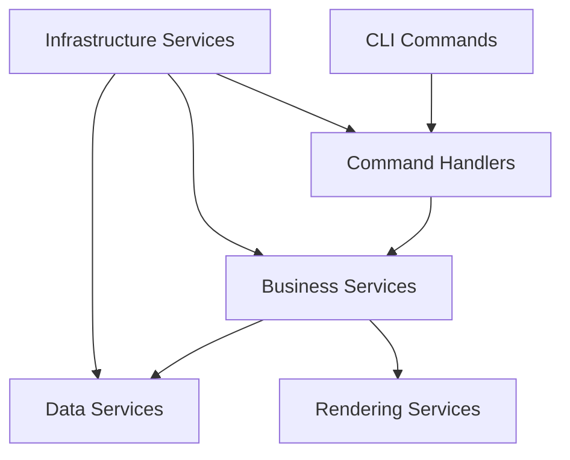

# GAPIR Service Architecture Documentation

This document describes the service architecture and dependencies between CLI commands, handlers, and services in the GAPIR (Graph API Review) tool.

## Architecture Overview



## Command-to-Handler-to-Service Mapping

### 1. **Review Command** (Default/Pending PRs)
```
CLI: `gapir` or `gapir review`
├── Handler: ReviewCommandHandler
└── Dependencies:
    ├── Business: PendingPullRequestService
    ├── Data: PullRequestDataLoader → PullRequestAnalysisService
    ├── Rendering: PullRequestRenderingService
    └── Infrastructure: ConnectionService, ConsoleLogger
```

### 2. **Approved Command**
```
CLI: `gapir approved`
├── Handler: ApprovedCommandHandler  
└── Dependencies:
    ├── Business: ApprovedPullRequestService
    ├── Data: PullRequestDataLoader → PullRequestAnalysisService
    ├── Rendering: PullRequestRenderingService (shared)
    └── Infrastructure: ConnectionService, ConsoleLogger
```

### 3. **Completed Command**
```
CLI: `gapir completed [--days-back N]`
├── Handler: CompletedCommandHandler
└── Dependencies:
    ├── Business: CompletedPullRequestService
    ├── Data: CompletedPullRequestDataLoader → PullRequestAnalysisService
    ├── Rendering: PullRequestRenderingService (shared)
    └── Infrastructure: ConnectionService, ConsoleLogger
```

### 4. **Diagnose Command**
```
CLI: `gapir diagnose <PR_ID>`
├── Handler: DiagnoseCommandHandler
└── Dependencies:
    ├── Business: PullRequestDiagnostics
    ├── Data: PullRequestDiagnosticService
    ├── Rendering: PullRequestDiagnosticRenderingService (ISOLATED)
    └── Infrastructure: ConnectionService, ConsoleLogger
```

### 5. **Collect Command**
```
CLI: `gapir collect [--dry-run]`
├── Handler: CollectCommandHandler
└── Dependencies:
    ├── Business: ReviewerCollector
    ├── Data: (Uses raw Azure DevOps API)
    └── Infrastructure: ConnectionService, ConsoleLogger
```

### 6. **Preferences Command**
```
CLI: `gapir preferences get|set`
├── Handler: PreferencesCommandHandler
└── Dependencies:
    ├── Business: PreferencesService
    ├── Data: GraphAuthenticationService
    └── Infrastructure: (None - direct console output)
```

## Service Layer Details

### **Shared Services (Used by Multiple Commands)**
- **PullRequestRenderingService**: Handles table rendering for review, approved, and completed commands
- **ConnectionService**: Azure DevOps authentication and connection management
- **ConsoleLogger**: Logging and console output formatting
- **PullRequestAnalysisService**: Core PR analysis logic (vote status, timing, etc.)

### **Command-Specific Services**
- **PullRequestDiagnosticRenderingService**: Only used by diagnose command (separate from main rendering)
- **CompletedPullRequestDataLoader**: Specialized data loading for completed PRs with date filtering
- **PreferencesService**: Graph API integration for reviewer preferences

### **Infrastructure Services**
- **TerminalLinkService**: OSC 8 hyperlink generation
- **ApiReviewersGroupService**: Reviewer group membership resolution
- **ReviewersConfigurationService**: JSON configuration management

## Confusing Naming Issues Identified

### **Issue 1: Diagnostic Rendering Confusion**
```
❌ Problem:
- PullRequestDiagnosticRenderingService.cs exists but diagnose command doesn't use it
- Creates confusion about which rendering service is used where

✅ Current Reality:
- DiagnoseCommandHandler does NOT use PullRequestDiagnosticRenderingService
- It outputs simple console messages directly
- PullRequestDiagnosticRenderingService appears to be unused legacy code
```

### **Issue 2: Service Distribution**
```
├── gapir/
│   ├── Services/               # Rendering & Infrastructure Services
│   │   ├── PullRequestRenderingService.cs (MAIN - used by 3 commands)
│   │   └── PullRequestDiagnosticRenderingService.cs (UNUSED?)
│   └── PullRequestDiagnosticRenderingService.cs (DUPLICATE LOCATION?)
└── gapir.core/
    └── Services/               # Business & Data Services
        ├── PullRequestDiagnosticService.cs
        └── [All other business services]
```

## Recommended Cleanups

1. **Remove Unused Diagnostic Rendering Service**
   - `PullRequestDiagnosticRenderingService.cs` appears unused by DiagnoseCommandHandler
   - Consider removing or integrating it properly

2. **Clarify Service Boundaries**
   - All rendering services should be in `gapir/Services/`
   - All business/data services should be in `gapir.core/Services/`

3. **Consistent Naming**
   - Keep "Rendering" suffix for UI-related services
   - Keep "Service" suffix for business logic services
   - Keep "DataLoader" suffix for data access services

## Data Flow Example (Completed Command)

```
User: gapir completed --days-back 7
  ↓
CompletedCommandHandler.HandleAsync()
  ↓
CompletedPullRequestService.GetCompletedPullRequestsAsync()
  ↓
CompletedPullRequestDataLoader.LoadCompletedPullRequestsAsync()
  ↓
PullRequestAnalysisService.AnalyzePullRequestsAsync()
  ↓
PullRequestRenderingService.RenderCompletedPullRequests()
  ↓
Console Output with formatted table
```

## Summary

- **6 CLI commands** map to **6 command handlers**
- **PullRequestRenderingService is shared** by review/approved/completed commands
- **PullRequestDiagnosticRenderingService exists but is unused** by the diagnose command
- **Service distribution** follows a clean separation between UI (gapir) and business logic (gapir.core)